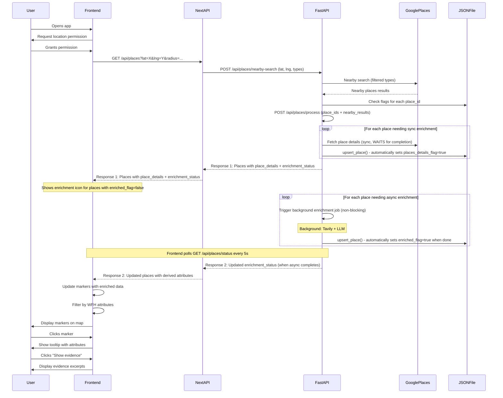
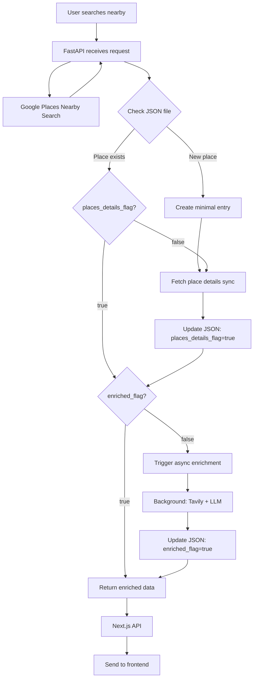

# Coffee App Frontend & Backend Integration

Plan

## Architecture Overview

The system has three layers (Option A - Next.js API Route as proxy):

1. **Frontend (Next.js)**: Google Maps interface with filters, markers, and tooltips
2. **Next.js API Route**: Thin proxy layer that forwards requests to FastAPI (no direct Google API calls)

- Receives requests from frontend
- Proxies to FastAPI backend
- Passes responses back to frontend

3. **FastAPI Backend**: 

- **Single point of contact** for all Google Places API calls (API key stays server-side)
- Manages places_bootstrap.json
- Handles enrichment orchestration (sync + async)
- Serves enriched place data
- Can cache Google API responses to reduce costs

**Data Flow**: Frontend → Next.js API → FastAPI → Google Places API → FastAPI → Next.js API → Frontend

## User Process Flow




## Backend Process Flow

### 1. Place Discovery & Enrichment Pipeline




### 2. Enrichment Status Tracking & Response Flow

**Sync Enrichment (Blocking):**

- **places_details_flag=false**: Trigger sync enrichment (place details) **immediately and WAIT for completion**
- Returns place_details in Response 1
- Updates JSON with `places_details_flag=true` automatically

**Async Enrichment (Non-blocking):**

- **enriched_flag=false**: Trigger async enrichment in background, return immediately with status
- Frontend receives Response 1 with `enriching: true` status
- Frontend shows enrichment icon/spinner for places with `enriched_flag=false`
- Frontend polls `GET /api/places/status` every 5 seconds
- When async enrichment completes, frontend calls `GET /api/places/data` to get updated derived attributes
- Frontend receives Response 2 with complete enriched data

**Two-Response Flow:**

1. **Response 1 (Immediate)**: Place details + basic info + enrichment status
2. **Response 2 (Via Polling)**: Updated derived attributes when async enrichment completes

## Implementation Details

### FastAPI Backend (`backend/api/main.py`)

**Endpoints:**

1. `POST /api/places/nearby-search` - Search nearby places (replaces direct Google API calls)

- Input: `{"lat": float, "lng": float, "radius": int, "types": ["cafe", "coffee_shop", ...]}`
- Behavior:
- Calls Google Places Nearby Search API (server-side, API key protected)
- Extracts place_ids from results
- Checks JSON file for each place_id
- **Sync enrichment (blocking)**: If `places_details_flag=false`, triggers sync enrichment and **WAITS for completion** before returning
- **Async enrichment (non-blocking)**: If `enriched_flag=false`, triggers async enrichment in background (returns immediately)
- Loads enriched data from JSON (place_details available, derived attributes may be pending)
- Returns combined response with places data + enrichment status
- Output: `{"places": [...], "enrichment_status": {"place_id": {"places_details_flag": bool, "enriched_flag": bool, "enriching": bool}}}`
- **Response Flow**:
- **Response 1 (immediate)**: Returns with place_details (sync complete) + enrichment_status showing which places are still enriching
- **Response 2 (via polling)**: Frontend polls `GET /api/places/status` and `GET /api/places/data` to get updated derived attributes when async enrichment completes
- **Note**: This is the main endpoint that orchestrates the entire flow

2. `GET /api/places/data` - Get enriched place data (for refreshing after async enrichment)

- Query params: `place_ids` (comma-separated)
- Output: Full place objects with `place`, `derived`, `sources` from JSON file
- Returns current state from JSON (may have partial data if async enrichment in progress)

3. `GET /api/places/status` - Check current enrichment status (read-only, for polling)

- Query params: `place_ids` (comma-separated)
- Output: `{"place_id": {"places_details_flag": bool, "enriched_flag": bool, "enriching": bool}}`
- **Purpose**: Used by frontend to poll for async enrichment completion

**Background Jobs:**

- Use FastAPI BackgroundTasks for async enrichment
- Track enrichment status in memory: `{place_id: {"enriching": bool}}`
- **Automatic flag updates**: When `enrich_place_details_sync()` or `enrich_place_web_async()` complete, they call `upsert_place()` which automatically saves to JSON with updated flags (`places_details_flag=True` or `enriched_flag=True`)

**Google Places API Integration:**

- All Google Places API calls go through FastAPI (never from frontend)
- FastAPI uses `backend/enrichment/google_places.py` functions:
- `nearby_search()` - For initial place discovery
- `place_details()` - For sync enrichment
- API key stored in FastAPI environment variables (server-side only)
- Can add caching layer to reduce API costs (cache Google responses for 1-24 hours)

### Next.js API Route (`coffee-map/app/api/places/route.ts`) - **CHOSEN: Option A**

**Decision**: Keep Next.js API route as a thin proxy layer.**Architecture:**

- Acts as a thin proxy layer between frontend and FastAPI
- Can handle request/response transformation if needed
- Provides a consistent API interface
- **Flow**: Frontend → Next.js API → FastAPI → Google Places API

**Implementation Flow:**

1. Receive request with `lat`, `lng`, `radius` (and optional `filters` for WFH attributes)
2. Call FastAPI `POST /api/places/nearby-search` with location and types

- FastAPI handles: Google Places API call, enrichment orchestration, JSON file operations
- Returns places with enriched data + enrichment status

3. Forward response to frontend (no transformation needed, just pass through)

**Google Maps Types Filter (passed to FastAPI):**

- `cafe`, `coffee_shop`, `bakery`, `tea_house`, `sandwich_shop`, `breakfast_restaurant`, `brunch_restaurant`, `diner`, `restaurant`
- `library`, `internet_cafe`, `book_store`, `community_center`
- `hotel`, `bed_and_breakfast`, `hostel`, `extended_stay_hotel`, `resort_hotel`

**IMPORTANT**: All Google Places API calls are **REMOVED** from Next.js. The current `route.ts` file (lines 14-46) that calls Google Places API directly will be completely rewritten to:

- Remove all Google Places API calls
- Remove `GOOGLE_PLACES_API_KEY` usage
- Only proxy requests to FastAPI `POST http://localhost:8000/api/places/nearby-search`
- Pass through responses to frontend

### Frontend Components (`coffee-map/app/`)

**Main Page (`page.tsx`):**

- Google Maps integration
- Get user location on load, zoom to location
- Display markers for nearby places
- Filter sidebar for WFH attributes
- InfoWindow tooltips with attributes
- "Show evidence" button in tooltips

**New Components:**

1. `components/FilterSidebar.tsx` - WFH attribute filters

- Checkboxes for: has_wifi, has_outlets, is_laptop_friendly, noise_level, seating_availability, seating_comfort, open_after_7pm
- Filter by place detail attributes: restroom, outdoorSeating, etc.

2. `components/PlaceTooltip.tsx` - Enhanced InfoWindow

- Display all non-unknown attributes
- "Show evidence" button
- Enrichment status indicator (icon if enriching)

3. `components/EvidenceModal.tsx` - Modal showing evidence excerpts

- Display evidence from `derived[attribute].evidence`
- Show sources from `derived[attribute].sources`

**State Management:**

- `places`: Array of Place objects with enriched data
- `filters`: Object with WFH filter selections
- `enrichingPlaces`: Set of place_ids currently enriching
- Poll FastAPI `GET /api/places/status` for places with `enriched_flag=false` (every 5 seconds)

### Data Flow

**Place Object Structure (Frontend):**

```typescript
type EnrichedPlace = {
  id: string;
  name: string;
  lat: number;
  lng: number;
  address?: string;
  rating?: number;
  // ... basic fields
  
  // Place detail attributes
  restroom?: boolean;
  servesCoffee?: boolean;
  outdoorSeating?: boolean;
  // ... other place detail attrs
  
  // Derived attributes
  derived?: {
    has_wifi?: { value: string; confidence: number; evidence: string[] };
    has_outlets?: { value: string; confidence: number; evidence: string[] };
    is_laptop_friendly?: { value: string; confidence: number; evidence: string[] };
    noise_level?: { value: string; confidence: number; evidence: string[] };
    seating_availability?: { value: string; confidence: number; evidence: string[] };
    seating_comfort?: { value: string; confidence: number; evidence: string[] };
    open_after_7pm?: { value: string; confidence: number; evidence: string[] };
    notable_positives?: { value: string[]; evidence: string[] };
    common_complaints?: { value: string[]; evidence: string[] };
  };
  
  // Enrichment status
  places_details_flag: boolean;
  enriched_flag: boolean;
  enriching?: boolean; // Currently enriching in background
};
```


## File Structure

```javascript
backend/
  api/
    __init__.py
    main.py              # FastAPI app
    routes/
      __init__.py
      places.py          # Place endpoints (nearby-search, data, status)
    services/
      __init__.py
      google_places_service.py  # Google Places API wrapper (server-side only)
      enrichment_service.py     # Enrichment orchestration
      json_service.py           # JSON file operations
  enrichment/            # Existing enrichment modules
  data/
    places_bootstrap.json

coffee-map/
  app/
    api/
      places/
        route.ts         # Modified to call FastAPI
    components/
      FilterSidebar.tsx
      PlaceTooltip.tsx
      EvidenceModal.tsx
    page.tsx             # Modified with filters and tooltips
```


## Key Implementation Notes

1. **FastAPI Setup:**

- Use `uvicorn` to run FastAPI server on port 8000
- **CORS middleware** for frontend (required if removing Next.js API route, recommended either way)
- BackgroundTasks for async enrichment
- Path to JSON: `backend/data/places_bootstrap.json`
- **Google Places API**: All calls go through FastAPI (API key in server-side env, never exposed to frontend)
- **REMOVED from Next.js**: All Google Places API calls removed from `coffee-map/app/api/places/route.ts`
- **Optional caching**: Can add response caching for Google API calls to reduce costs (Redis or in-memory)

2. **Enrichment Orchestration:**

- `process_nearby_search_sync()` - Already exists, use for sync enrichment
- Calls `enrich_place_details_sync()` → `upsert_place()` → **automatically sets `places_details_flag=True` in JSON**
- `process_enrichment_async()` - Already exists, use for async enrichment
- Calls `enrich_place_web_async()` → `upsert_place()` → **automatically sets `enriched_flag=True` in JSON**
- Track enrichment status in memory (dict: `{place_id: {"enriching": bool}}`) for real-time status
- **Important**: Flags are automatically persisted to JSON when enrichment completes - no manual flag updates needed

3. **Frontend Filtering:**

- Filter places client-side after receiving from API
- Filter by derived attributes (has_wifi, has_outlets, etc.)
- Filter by place detail attributes (restroom, outdoorSeating, etc.)
- Show "unknown" values in filters as optional (don't exclude)

4. **Tooltip Display:**

- Show all attributes where `value !== "unknown"` and `value !== null`
- Format: "WiFi: Free (70% confidence)" or "Outlets: Many"
- "Show evidence" button opens modal with evidence excerpts

5. **Enrichment Status & Two-Response Flow:**

- **Response 1 (Immediate)**: 
- FastAPI waits for sync enrichment (place_details) to complete
- Returns place_details + enrichment_status showing which places are still enriching
- Frontend displays markers with place_details immediately
- Shows enrichment icon/spinner on markers for places with `enriched_flag=false`
- **Response 2 (Via Polling)**:
- Frontend polls FastAPI `GET /api/places/status` every 5 seconds for places with `enriched_flag=false`
- When polling detects `enriched_flag=true`, frontend calls `GET /api/places/data` to get updated derived attributes
- Frontend updates markers with complete enriched data (derived attributes now available)
- Removes enrichment icon when complete
- **Automatic Flag Updates**: When enrichment completes, flags are **automatically updated** in JSON:
- `enrich_place_details_sync()` → calls `upsert_place()` → sets `places_details_flag=True`
- `enrich_place_web_async()` → calls `upsert_place()` → sets `enriched_flag=True`

## Environment Variables

**FastAPI (.env):**

- `GOOGLE_PLACES_API_KEY` - **Required**: Used server-side for all Google Places API calls
- `TAVILY_API_KEY` - Required for async enrichment
- `OPENAI_API_KEY` - Required for LLM-based attribute derivation