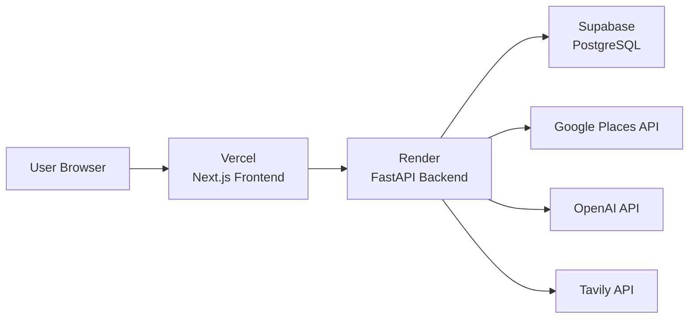

# Migrate Coffee App to Vercel + Render

## Overview

Deploy the Next.js frontend to Vercel and the FastAPI backend to Render (free tier). The application uses Supabase for PostgreSQL database, which is already cloud-hosted.

## Architecture

## Recommended Workflow

**Yes, deploy first to get URLs, then configure environment variables:**

1. **Create deployment config files** (render.yaml, Procfile, vercel.json) - enables deployment
2. **Update code** to use environment variables (already mostly done)
3. **Deploy to Render** - get backend URL (e.g., `https://your-app.onrender.com`)
4. **Deploy to Vercel** - get frontend URL (e.g., `https://your-app.vercel.app`)
5. **Configure environment variables** in both service dashboards:

- Vercel: Set `FASTAPI_BASE_URL` to Render URL
- Render: Set `ALLOWED_ORIGINS` to Vercel URL (for CORS)
- Both: Add API keys and database URLs

This approach ensures you have the actual production URLs before configuring cross-service communication.

## Implementation Steps

### 1. Frontend Deployment (Vercel)

**Files to create/modify:**

- `coffee-map/vercel.json` - Vercel configuration
- `coffee-map/.env.example` - Environment variable template
- Update `coffee-map/app/api/places/route.ts` - Use environment variable for backend URL

**Changes:**

- Add `vercel.json` with build settings
- Update `FASTAPI_BASE_URL` in `route.ts` to use `process.env.FASTAPI_BASE_URL` (already done, but verify)
- Configure environment variables in Vercel dashboard

### 2. Backend Deployment (Render)

**Files to create/modify:**

- `backend/render.yaml` or `Procfile` - Render deployment configuration
- `backend/requirements.txt` - Verify all dependencies are listed
- Update `backend/api/main.py` - CORS settings for production domain
- Create `backend/.env.example` - Environment variable template

**Changes:**

- Add `Procfile` with: `web: uvicorn backend.api.main:app --host 0.0.0.0 --port $PORT`
- OR create `render.yaml` with service configuration (recommended for Render)
- Update CORS in `main.py` to allow Vercel domain
- Configure environment variables in Render dashboard

### 3. Environment Variables Setup

**After deploying both services, configure these in their respective dashboards:Vercel Environment Variables (set after Render deployment):**

- `FASTAPI_BASE_URL` - Render backend URL (e.g., `https://your-app.onrender.com`) - **Get this from Render dashboard after deployment**

**Render Environment Variables:**

- `GOOGLE_PLACES_API_KEY` - Google Places API key (use existing key)
- `TAVILY_API_KEY` - Tavily API key (use existing key)
- `OPENAI_API_KEY` - OpenAI API key (use existing key)
- `DATABASE_URL` - Supabase PostgreSQL connection string (use existing connection)
- `ALLOWED_ORIGINS` - Vercel frontend URL (e.g., `https://your-app.vercel.app`) - **Get this from Vercel dashboard after deployment**
- `PORT` - Automatically set by Render (defaults to 10000) - **No need to set manually**

### 4. Database Configuration

**No changes needed** - Supabase is already cloud-hosted. Ensure `DATABASE_URL` in Render points to your Supabase instance.

### 5. Deployment Configuration Files

**Create:**

- `backend/render.yaml` - Render service configuration (recommended) OR `backend/Procfile` - For Render deployment
- `backend/.env.example` - Template for environment variables
- `coffee-map/.env.example` - Template for frontend environment variables
- `coffee-map/vercel.json` - Vercel configuration (if needed)

### 6. CORS and Security Updates

**Update `backend/api/main.py`:**

- Replace hardcoded `localhost` origins with environment variable
- Read `ALLOWED_ORIGINS` from environment (comma-separated list)
- Support both production (Vercel) and development (localhost) origins
- Keep development origins for local testing when `ALLOWED_ORIGINS` is not set

## Render-Specific Notes

- Render free tier spins down after 15 minutes of inactivity (takes ~30s to wake up)
- Use `render.yaml` for better configuration control