# Places Bootstrap Enrichment System

## Overview

This plan implements an automatic enrichment pipeline with **explicit separation of sync and async operations**:**Sync Operations** (happens immediately when nearby_search is called):

1. Collect and deduplicate place_ids from nearby_search results
2. Upsert place_ids to `backend/data/places_bootstrap.json` (dictionary keyed by place_id)
3. Optionally fetch place_details if `places_details_flag` is false (for missing core fields and binary attributes)

**Async Operations** (happens separately, not during nearby_search):

1. Run Tavily web searches for places where `enriched_flag` is false
2. Extract signals from reviews + Tavily content
3. Populate derived attributes
4. Save all cleaned content to `sources` in JSON

## Architecture Flow

```mermaid
flowchart TB
    subgraph Sync["Sync Operations (during nearby_search)"]
        NS[nearby_search called] --> EXTRACT[Extract place_ids]
        EXTRACT --> UPSERT[Upsert to JSON]
        UPSERT --> CHECK{places_details_flag?}
        CHECK -->|false| PD[Call place_details with binary fields]
        PD --> BINARY[Extract binary attributes]
        BINARY --> SAVE1[Save to JSON with flag=true]
        CHECK -->|true| DONE1[Sync Complete]
        SAVE1 --> DONE1
    end
    
    subgraph Async["Async Operations (separate call)"]
        TRIGGER[Trigger async enrichment] --> CHECK2{enriched_flag?}
        CHECK2 -->|false| TAVILY[Run Tavily web search]
        TAVILY --> SAVE_T[Save Tavily content to sources]
        SAVE_T --> LOAD_EVIDENCE[Load Google reviews + Tavily results]
        LOAD_EVIDENCE --> LLM[LLM: Derive attributes from ALL evidence]
        LLM --> DERIVED[Populate derived attributes with confidence]
        DERIVED --> SAVE2[Save to JSON with enriched_flag=true]
        CHECK2 -->|true| DONE2[Async Complete]
        SAVE2 --> DONE2
    end
```




## File Structure and Responsibilities

### 1. `json_storage.py` - JSON File Utilities

**Purpose**: Minimal utility module for JSON file operations**Functions**:

- `load_places_json(path: str) -> Dict[str, Dict]`: Load JSON file, return dictionary keyed by place_id
- `save_places_json(path: str, places: Dict[str, Dict])`: Save dictionary to JSON file
- `upsert_place(path: str, place: Dict)`: Upsert a single place entry (add if new, update if exists) based on place_id
- `upsert_place_ids(path: str, place_ids: List[str])`: Upsert multiple place_ids, creating minimal entries for new ones

**JSON Structure**: Dictionary keyed by `place_id`:

```json
{
  "place_id_1": { "place_id": "place_id_1", "places_details_flag": false, ... },
  "place_id_2": { "place_id": "place_id_2", "places_details_flag": false, ... }
}
```

### 2. `google_places.py` - Enhanced Place Details

**Purpose**: Fetch place data from Google Places API**Changes**:

- **Enhance existing `place_details()` function** to use **Places API (New)** endpoint and include binary attributes
- Since Place Data Fields are part of Place Details, we enhance the existing function rather than creating a new one
- Endpoint: `GET https://places.googleapis.com/v1/places/{place_id}`
- Use `X-Goog-FieldMask` header to request fields:
  - Core: `id`, `displayName`, `formattedAddress`, `location`, `types`, `rating`, `userRatingCount`, `priceLevel`, `businessStatus`, `currentOpeningHours`, `website`, `reviews`
  - Binary attributes: `restroom`, `servesCoffee`, `goodForGroups`, `accessibilityOptions`, `parkingOptions` (if available in API)
- Reference: [Place Details (New)](https://developers.google.com/maps/documentation/places/web-service/place-details) and [Place Data Fields (New)](https://developers.google.com/maps/documentation/places/web-service/data-fields)

**Functions**:

- `nearby_search(cfg: Config, place_type: str) -> List[Dict]`: (unchanged)
- `place_details(cfg: Config, place_id: str) -> Dict`: (enhanced to include binary attributes)

### 3. `place_enrichment.py` - Sync and Async Enrichment

**Purpose**: Contains both sync (place_details) and async (Tavily + LLM) enrichment logic**Note**: The async enrichment uses TWO LLM calls:

1. Tavily search agent (optional, or use TavilySearch directly) - just to collect web results
2. Unified attribute derivation LLM - takes Google reviews + Tavily results together to derive attributes with confidence scores**Sync Function**: `enrich_place_details_sync(cfg: Config, place_id: str, existing_place: Dict) -> Dict`

- Checks if `places_details_flag` is false
- Calls enhanced `google_places.place_details()` to get all data including binary attributes
- **Extracts binary attributes (return `true`, `false`, or `null` if missing):**
- `restroom`: From API field if available, else `null`
- `ServesCoffee`: From API field if available, else check `types` array for coffee-related types, else `null`
- `outdoorSeating`: From API field if available, else `null`
- `goodForGroups`: From API field if available, else `null`
- `accessibilityOptions`: From API field (e.g., `wheelchairAccessibleEntrance`) if available, else `null`
- `parkingOptions`: From API field (e.g., `parkingOptions`) if available, else `null`
- Extracts `neighborhood` from address components or geometry
- **Saves all Google Maps reviews to `sources.google_reviews**`:
- `fetched_at`: ISO timestamp
- `reviews`: Full review array from API
- Saves full place_details response to `sources.google_details`:
- `fetched_at`: ISO timestamp
- `payload`: Complete API response
- Updates flags: `places_details_flag=True`, `places_details_called_at`, `places_details_called_version`

**Async Function**: `enrich_place_web_async(cfg: Config, place: Dict, existing_place: Dict) -> Dict`

- Checks if `enriched_flag` is false
- **Step 1: Run Tavily web search** (just to collect web results, not to derive attributes):
- Uses TavilySearch directly or calls a helper function to search for place
- Constructs query from place name + location (e.g., "Is Birch Coffee in Flatiron good for working laptop wifi outlets")
- Gets Tavily search results and excerpts
- **Saves all Tavily content to `sources.tavily**`:
  - `fetched_at`: ISO timestamp
  - `query`: The search query used
  - `results`: Full Tavily search results array (with url, title, snippet, score)
  - `excerpts`: Full Tavily excerpts array (with url, text) if available
- **Step 2: Derive attributes using LLM** (combines Google reviews + Tavily results):
- Calls new function `derive_attributes_from_evidence()` (see below)
- This function takes:
  - Google reviews (from `sources.google_reviews.reviews` in existing_place)
  - Tavily results and excerpts (from `sources.tavily` just saved)
  - Place information (name, address, etc.)
- Uses LLM to analyze ALL evidence together and derive attributes with confidence scores
- Returns structure matching schema's `derived` section
- Updates flags: `enriched_flag=True`, `enriched_at`, `enriched_version`

**New LLM Function**: `derive_attributes_from_evidence(place: Dict, google_reviews: List[Dict], tavily_results: List[Dict], tavily_excerpts: List[Dict]) -> Dict`

- **Purpose**: Unified LLM call that takes ALL evidence (Google reviews + Tavily) and derives attributes with confidence scores
- **Input**:
- `place`: Place dict with name, address, etc.
- `google_reviews`: Full array of Google Maps reviews
- `tavily_results`: Tavily search results (url, title, snippet, score)
- `tavily_excerpts`: Tavily excerpts (url, text)
- **Process**:
- Combines all evidence into a structured prompt
- Uses LLM (ChatOpenAI) with structured output to derive attributes
- LLM analyzes BOTH Google reviews AND Tavily content together
- For each attribute, LLM provides:
  - `value`: The attribute value (e.g., "free", "many", "yes", "quiet")
  - `confidence`: Float 0.0-1.0 based on strength of evidence from ALL sources
  - `sources`: Array of source identifiers (e.g., `["google_reviews", "tavily_https://example.com"]`)
  - `evidence`: Array of specific evidence snippets from both sources (e.g., `["Review: 'Fast Wi-Fi, worked here for hours'", "Tavily excerpt: 'The cafe offers free WiFi and plenty of outlets'"]`)
- **Output**: Returns `derived` section matching schema:
- `has_wifi`: `{value: "free"|"paid"|"none", confidence: float, sources: [], evidence: []}`
- `has_outlets`: `{value: "many"|"few"|"none", confidence: float, sources: [], evidence: []}`
- `is_laptop_friendly`: `{value: "yes"|"mixed"|"no", confidence: float, sources: [], evidence: []}`
- `noise_level`: `{value: "quiet"|"mixed"|"loud", confidence: float, sources: [], evidence: []}`
- `seating_availability`: `{value: "good"|"mixed"|"limited", confidence: float, sources: [], evidence: []}`
- `seating_comfort`: `{value: "good"|"mixed"|"bad", confidence: float, sources: [], evidence: []}`
- `notable_positives`: `{value: [str], sources: [], evidence: [str]}`
- `common_complaints`: `{value: [str], sources: [], evidence: [str]}`
- **Implementation**: Uses structured output (Pydantic model or JSON mode) to ensure consistent format
- **Key point**: Attributes are derived from BOTH sources together, not separately. The LLM considers all evidence holistically to determine confidence scores.

### 4. `places_manager.py` - Orchestration

**Purpose**: Orchestrates sync and async operations separately**Sync Function**: `process_nearby_search_sync(cfg: Config, results: List[Dict], json_path: str = "backend/data/places_bootstrap.json") -> List[str]`

- Extracts place_ids from nearby_search results
- Uses `json_storage.upsert_place_ids()` to add new place_ids (creates minimal entries for new ones)
- For each place_id (new or existing):
- Loads place from JSON using dictionary lookup
- If `places_details_flag` is false: 
  - Call `place_enrichment.enrich_place_details_sync()`
  - Upsert updated place to JSON
- Returns list of place_ids that were processed
- **Does NOT call Tavily or async enrichment**

**Async Function**: `process_enrichment_async(cfg: Config, place_ids: Optional[List[str]] = None, json_path: str = "backend/data/places_bootstrap.json") -> int`

- If `place_ids` is None, loads all places from JSON
- For each place_id where `enriched_flag` is false:
- Loads place from JSON
- Calls `place_enrichment.enrich_place_web_async()`
- Upserts updated place to JSON
- Returns count of places enriched

**Helper Function**: `get_places_needing_enrichment(json_path: str) -> List[str]`

- Returns list of place_ids where `enriched_flag` is false

### 5. `google_places.py` - Wrapper for Sync Operations

**Changes**:

- Add `nearby_search_with_sync(cfg: Config, place_type: str, auto_enrich_sync: bool = True) -> List[Dict]`
- Calls `nearby_search(cfg, place_type)`
- If `auto_enrich_sync=True`, calls `places_manager.process_nearby_search_sync()` with results
- Returns original nearby_search results (unchanged)
- **Does NOT trigger async operations**

## Schema Mapping

### Binary Attributes (from Places API New)

All return `true`, `false`, or `null` (if missing):

- `restroom`: From Places API (New) field if available, else `null`
- `ServesCoffee`: From Places API (New) field if available, else check `types` array, else `null`
- `outdoorSeating`: From Places API (New) field if available, else `null`
- `goodForGroups`: From Places API (New) field if available, else `null`
- `accessibilityOptions`: From Places API (New) field (e.g., `wheelchairAccessibleEntrance`) if available, else `null`
- `parkingOptions`: From Places API (New) field (e.g., `parkingOptions`) if available, else `null`

### Derived Attributes (from extract_signals + web_searches)

- `has_wifi`: `{value: "free"|"paid"|"none", confidence: float, sources: [], evidence: []}`
- `has_outlets`: `{value: "many"|"few"|"none", confidence: float, sources: [], evidence: []}`
- `is_laptop_friendly`: `{value: "yes"|"mixed"|"no", confidence: float, sources: [], evidence: []}`
- `noise_level`: `{value: "quiet"|"mixed"|"loud", confidence: float, sources: [], evidence: []}`
- `seating_availability`: `{value: "good"|"mixed"|"limited", confidence: float, sources: [], evidence: []}`
- `seating_comfort`: `{value: "good"|"mixed"|"bad", confidence: float, sources: [], evidence: []}`
- `notable_positives`: `{value: [str], sources: [], evidence: [str]}`
- `common_complaints`: `{value: [str], sources: [], evidence: [str]}`

### Sources Structure

All cleaned content is saved to `sources`:

```json
{
  "sources": {
    "google_details": {
      "fetched_at": "2025-12-23T20:15:00Z",
      "payload": { ... }  // Full API response
    },
    "google_reviews": {
      "fetched_at": "2025-12-23T20:15:00Z",
      "reviews": [ ... ]  // Full review array
    },
    "tavily": {
      "fetched_at": "2025-12-23T20:16:30Z",
      "query": "...",
      "results": [ ... ],  // Full Tavily search results
      "excerpts": [ ... ]   // Full Tavily excerpts if available
    }
  }
}
```

## Usage Pattern

### Sync (during nearby_search):

```python
# In bootstrap.py or wherever nearby_search is called
results = google_places.nearby_search_with_sync(cfg, place_type="cafe")
# This automatically:
# 1. Saves place_ids to JSON
# 2. Optionally fetches place_details if needed
# 3. Does NOT call Tavily
```

### Async (separate call):

```python
# Run async enrichment separately (e.g., in a background job)
place_ids = places_manager.get_places_needing_enrichment()
places_manager.process_enrichment_async(cfg, place_ids=place_ids)
# Or process all places needing enrichment:
places_manager.process_enrichment_async(cfg)
```

## Files to Create/Modify

### New Files

1. `backend/enrichment/json_storage.py` - JSON file utilities (upsert, load, save)
2. `backend/enrichment/place_enrichment.py` - Sync (place_details) and async (Tavily) enrichment functions
3. `backend/enrichment/places_manager.py` - Orchestration of sync and async operations

### Modified Files

1. `backend/enrichment/google_places.py` - Enhance `place_details()` to include binary attributes, add `nearby_search_with_sync()` wrapper
2. `backend/enrichment/bootstrap.py` - Use `nearby_search_with_sync()` for sync operations

## Testing Strategy

1. Test sync operations: nearby_search → JSON upsert → place_details enrichment
2. Test async operations: Tavily enrichment → signal extraction → derived attributes
3. Test that sync and async are completely separate (async doesn't run during nearby_search)
4. Test that all content (reviews, Tavily results, excerpts) is saved to sources
5. Test deduplication (add same place_id twice)
6. Test conditional enrichment (skip if flags are true)
7. Test with empty JSON file (first run)
8. Test error handling (API failures, missing fields)

## Sample Test Script

See `sandbox.ipynb` section for a complete test script demonstrating:

- Sync operations (nearby_search + place_details)
- Async operations (Tavily search + LLM attribute derivation)
- Verification that all content is saved to sources
- Verification that attributes are derived from BOTH Google reviews and Tavily results together

## Key Design Decision: Unified LLM for Attribute Derivation

**Question**: Do we need an LLM to combine Google reviews + Tavily results?**Answer**: Yes. We use a **unified LLM call** (`derive_attributes_from_evidence()`) that:

- Takes ALL evidence together (Google reviews + Tavily results)
- Derives attributes with confidence scores based on the combined evidence
- Attributes are NOT derived separately from each source - they're derived holistically from all sources together
- This happens in **Step 2 of async enrichment** (after Tavily search is complete and saved to sources)

**Why not use the Tavily agent?**

- The existing `web_searches.enrich_place_with_agent()` only looks at Tavily results, not Google reviews
- We need a separate LLM call that considers BOTH sources together

