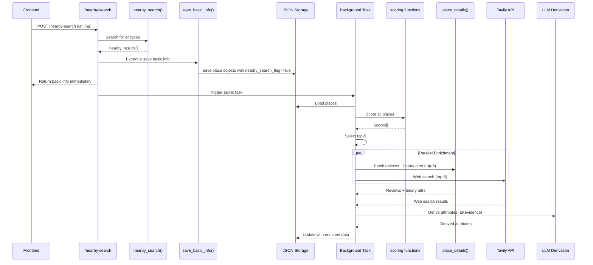
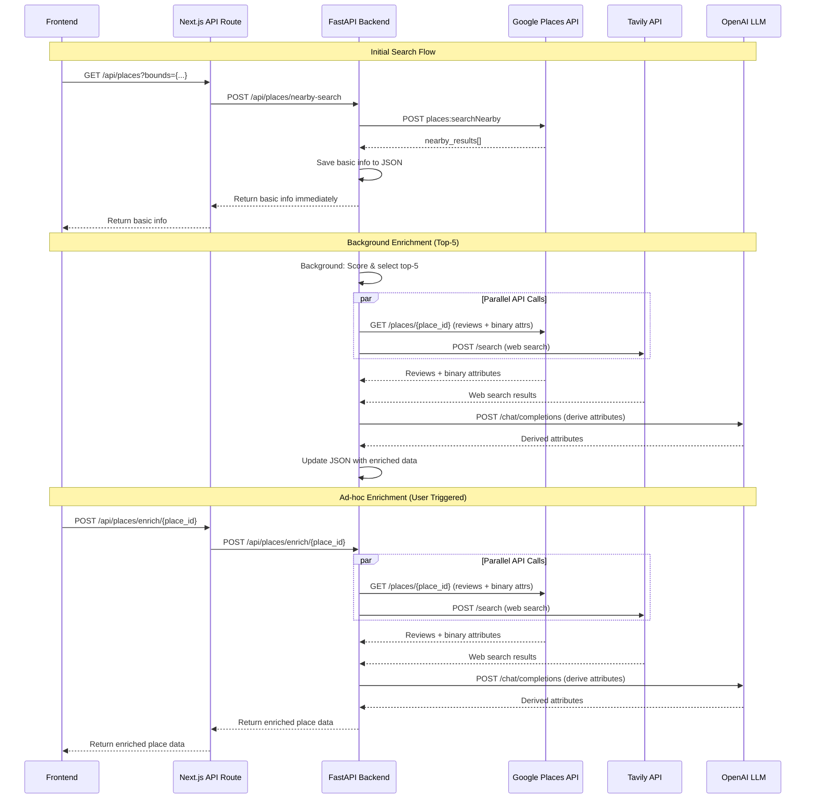

# Restructure Enrichment for Latency and Cost Reduction

## Current Flow Issues

- All places get sync enrichment (place_details) immediately, blocking response
- All places get async enrichment (Tavily + LLM), wasting API calls on irrelevant places
- High latency due to waiting for sync enrichment before returning results

## New Flow

### Synchronous Response (Immediate)

1. Run `nearby_search` for all requested types
2. Extract basic info from nearby_search results (photos, ratings, types, open hours, binary attributes)
3. Save basic info to JSON immediately (creates/updates place entries with `nearby_search_flag`)
4. Return basic info to frontend immediately (no waiting for enrichment)

### Asynchronous Background Processing

1. Score all candidates from nearby_search using scoring functions
2. Select top-5 places based on scores
3. For top-5 only: run full enrichment (place_details for reviews + Tavily + LLM)
4. Update JSON with enriched data and flags

### Ad-hoc Enrichment

- Add endpoint `/api/places/enrich/{place_id}` for user-triggered enrichment
- Frontend shows "Enrich" button for places without `enriched_flag`
- Only enriches if not already in top-5 or already enriched

## Implementation Details

### 1. Create Basic Info Extraction Function

**File**: `backend/enrichment/places_manager.py`

- New function: `extract_basic_info_from_nearby_search(nearby_result: Dict) -> Dict`
- Extracts ONLY: name, photos (processed), rating, user_ratings_total, types, regular_opening_hours, price_level, website, neighborhood, business_status, formatted_address, lat, lng
- **DO NOT** include binary attributes here (restroom, servesCoffee, etc.) - those come later from place_details
- Returns place object structure matching existing format
- Note: Frontend must preserve "Open in Google Maps" button functionality

### 2. Create Basic Info Save Function

**File**: `backend/enrichment/places_manager.py`

- New function: `save_basic_info_to_json(nearby_results: List[Dict], json_path: str) -> List[str]`
- For each nearby_result:
- Extract basic info using function above
- Upsert place_id if needed
- Update place object with basic info
- Set `nearby_search_flag = True` (new flag)
- Set `places_details_flag = False` (not yet enriched)
- Save to JSON

### 3. Create Scoring Module

**File**: `backend/enrichment/top_n_scoring.py` (new file)

- Implement scoring functions:
- `rating_score(rating: float) -> float` - 3.5 -> 0.0, 5.0 -> 1.0 (clamped)
- `popularity_score(user_ratings_total: int, max_reviews_in_viewport: int) -> float` - uses log to diminish returns
- `distance_score(distance_m: float, max_radius_m: float) -> float` - closer is better
- `wfh_type_score(types: list[str]) -> float` - uses WFH_TYPE_PRIORS dict
- New function: `score_place(place: Dict, user_lat: float, user_lng: float, max_radius_m: float, max_reviews: int) -> float`
- Combines all scores with weights
- Returns total score

### 4. Create Top-N Selection Function

**File**: `backend/enrichment/places_manager.py`

- New function: `select_top_n_places(places: List[Dict], user_lat: float, user_lng: float, max_radius_m: float, n: int = 5) -> List[str]`
- Scores all places
- Sorts by score descending
- Returns top-n place_ids
- Filters out places already enriched (`enriched_flag = True`)

### 5. Modify Place Details Enrichment (Now Async)

**File**: `backend/enrichment/place_enrichment.py`

- **Note**: `enrich_place_details_sync` will now run asynchronously (in background for top-5, or immediately for user-triggered)
- Modify `enrich_place_details_sync` to:
- Check if basic info already exists from nearby_search
- If yes, reuse basic info and only fetch from place_details:
- **Reviews** (for LLM derivation)
- **Binary attributes**: restroom, servesCoffee, outdoorSeating, goodForGroups, accessibilityOptions, parkingOptions, ServesCoffee
- Merge reviews and binary attributes into existing place object
- Don't overwrite basic info that's already there
- Set `places_details_flag = True` after successful fetch

### 6. Modify Nearby Search Endpoint

**File**: `backend/api/routes/places.py`

- Modify `/nearby-search` endpoint:
- Run nearby_search for all types
- Immediately save basic info to JSON (synchronous, but fast)
- Return basic info to frontend immediately
- Trigger background task for scoring + top-5 enrichment
- New background task: `score_and_enrich_top_n_background`
- Load places from JSON
- Score all places from nearby_search results
- Select top-5
- For top-5 places:
- Run place_details enrichment (async) - fetches reviews + binary attributes
- Run Tavily enrichment (async)
- **Wait for both to complete** before running LLM
- Run LLM derivation on all available evidence (Google reviews + Tavily)
- Handle partial evidence cases:
    - If place_details succeeds but Tavily fails: set `places_details_flag=True`, `tavily_flag=False`, `enriched_flag=True` (LLM uses only Google reviews)
    - If Tavily succeeds but place_details fails: set `places_details_flag=False`, `tavily_flag=True`, `enriched_flag=True` (LLM uses only Tavily)
    - If both succeed: set both flags to True, `enriched_flag=True`

### 7. Add Ad-hoc Enrichment Endpoint

**File**: `backend/api/routes/places.py`

- New endpoint: `POST /api/places/enrich/{place_id}`
- Check if place exists
- Check if already enriched (`enriched_flag = True`)
- If not enriched:
    - Run place_details enrichment (synchronous/immediate) - fetches reviews + binary attributes
    - Run Tavily enrichment (synchronous/immediate)
    - Wait for both to complete before running LLM
    - Run LLM derivation on all available evidence
    - Handle partial evidence cases (same logic as background task)
    - Return updated place data
- If already enriched, return existing data

### 8. Update Frontend

**File**: `coffee-map/app/page.tsx`

- Add "Enrich" button to place tooltips/info windows for places where `enriched_flag = False`
- Button calls new `/api/places/enrich/{place_id}` endpoint
- Show loading state while enriching
- Refresh place data after enrichment completes
- **Important**: Preserve existing "Open in Google Maps" button functionality - ensure it still works with basic info from nearby_search

### 9. Update JSON Schema

- Add `nearby_search_flag: bool` to track if basic info was saved from nearby_search
- Keep existing flags: `places_details_flag`, `tavily_flag`, `enriched_flag`

## Data Flow Diagram

## API Request Flow Diagram

## Key Changes Summary

1. **Immediate Response**: Return basic info from nearby_search without waiting for enrichment (name, photos, rating, types, open hours, etc. - NO binary attributes yet)
2. **Selective Enrichment**: Only enrich top-5 places based on scoring (async background task)
3. **Avoid Duplication**: When enriching, reuse basic info from nearby_search, only fetch reviews + binary attributes from place_details
4. **Parallel Async Enrichment**: place_details (reviews + binary attrs) and Tavily run in parallel, both complete before LLM runs
5. **Partial Evidence Handling**: If one API fails but the other succeeds, LLM still runs with available evidence and flags are set appropriately
6. **Ad-hoc Enrichment**: Allow users to manually enrich specific places (runs immediately, not async)
7. **New Flag**: `nearby_search_flag` to track basic info availability

## Files to Modify

1. `backend/enrichment/places_manager.py` - Add basic info extraction/saving, top-n selection