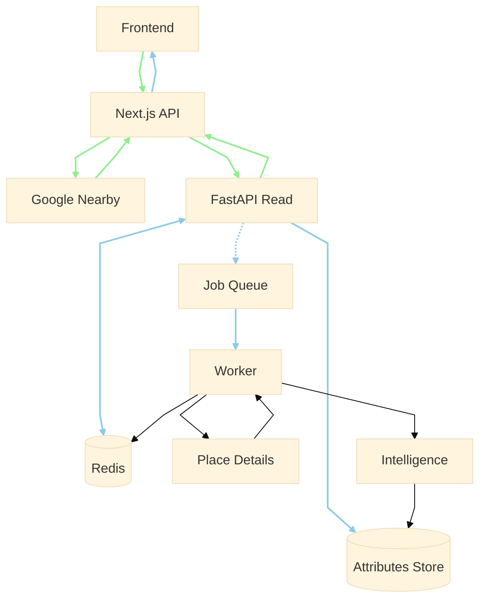

## Architecture

This app has two flows:
1. Read path (sync, fast): serve nearby places with WFH attributes
2. Write path (async/batch, slow): compute and maintain those attributes

### Read path (user-facing)

1. Frontend (Next.js) calls GET /api/search?lat=…&lng=…&radius=…&filters=…
2. Next.js API calls the Places Service (FastAPI) with the search context
3. FastAPI Places Service queries Postgres/PostGIS for places in radius + stored attributes
4. If coverage is low, FastAPI optionally calls Google Places Nearby Search to “top up” candidates, then returns results from DB immediately plus any “pending enrichment” items (still usable, but with lower confidence)

### Caching
Cache raw Google responses (short TTL) to reduce quota/latency
Cache enriched attributes (long TTL) and refresh stale ones asynchronously

### Write path (enrichment)

When a new place_id is discovered or attributes are stale, FastAPI enqueues an enrichment job
Worker (Python) fetches Google Place Details (only when needed), runs attribute extraction/scoring, and writes back to DB:
1. wifi/outlets/noise/seating scores + confidence
2. evidence snippets (why we believe the score)
3. optional LLM “vibe summary” grounded in retrieved evidence

### Truth layer (DB)

The database is the system of record for your “WFH-friendly” definition:
1. places (place_id, name, lat/lng, types, etc.)
2. place_attributes (scores, confidence, last_updated, evidence)
3. place_summaries (short summary, generated_from, timestamp)

-----------------

