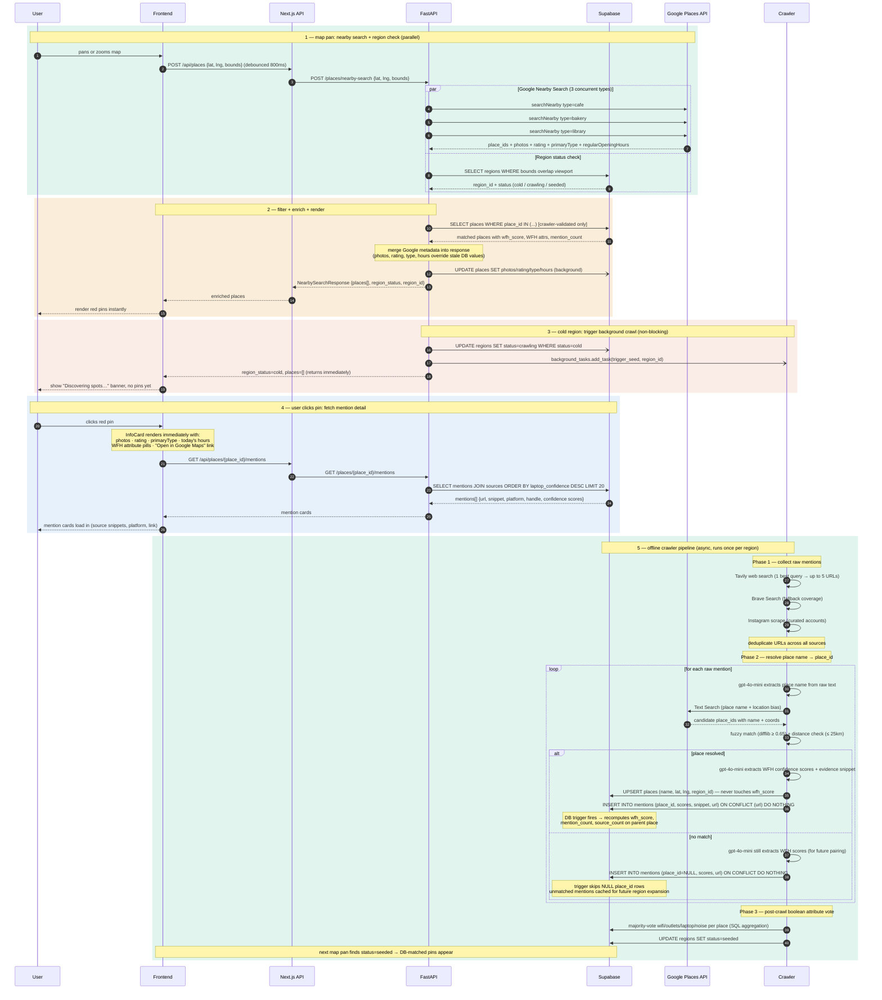

# V2 WFH Coffee Shop Finder — Sequence Diagram

## Arrow key

| Syntax | Meaning |
|--------|---------|
| `->>`  | Synchronous call (caller waits) |
| `-->>` | Response / return value |
| `-)`   | Async fire-and-forget (non-blocking) |
| `par`  | Parallel execution block |
| `loop` | Repeats for each item |
| `alt`  | Conditional branch |
