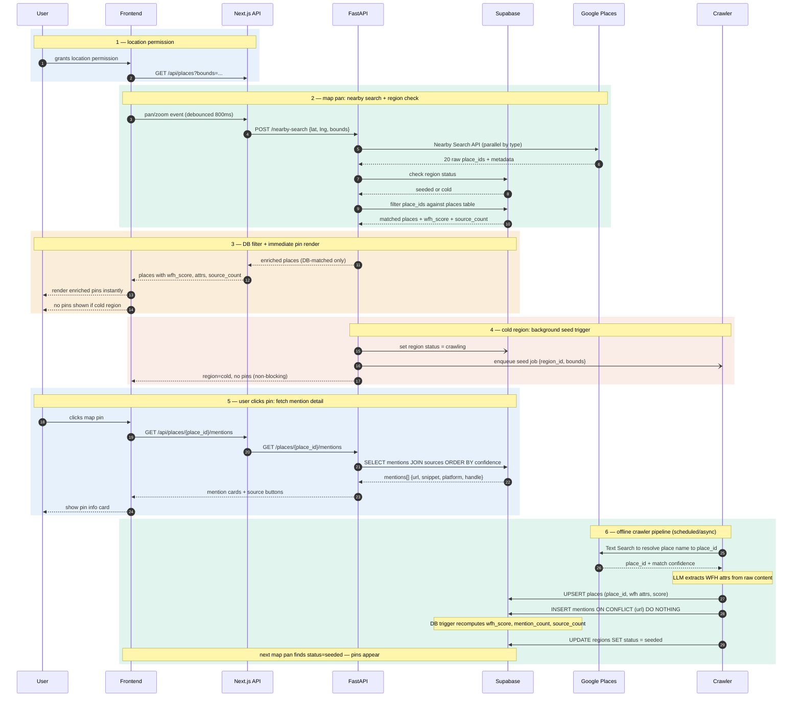

# V2 WFH Coffee Shop Finder — Sequence Diagram

## Arrow key

| Syntax | Meaning |
|--------|---------|
| `->>`  | Synchronous call |
| `-->>` | Response / return |
| `-)`   | Async fire-and-forget |